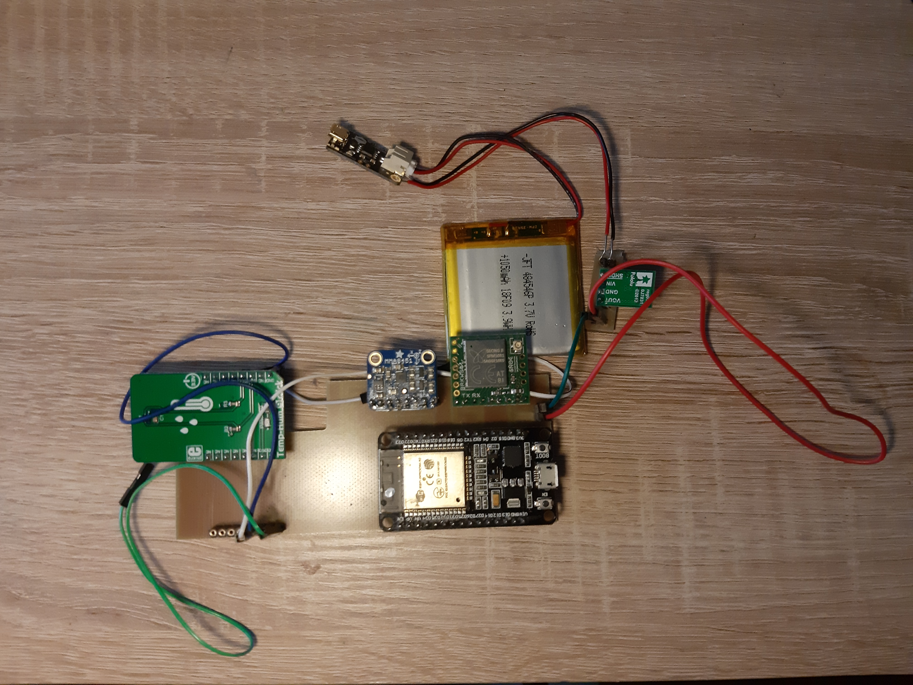
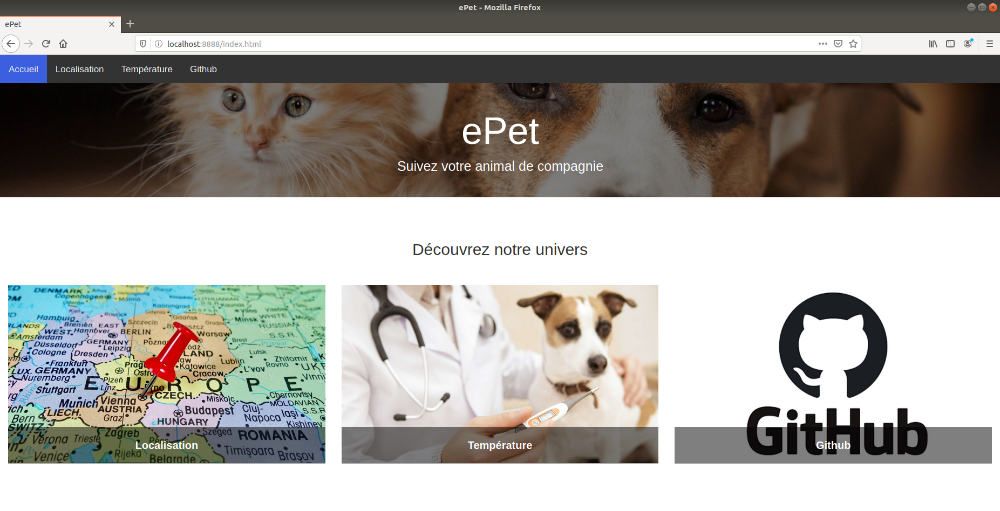
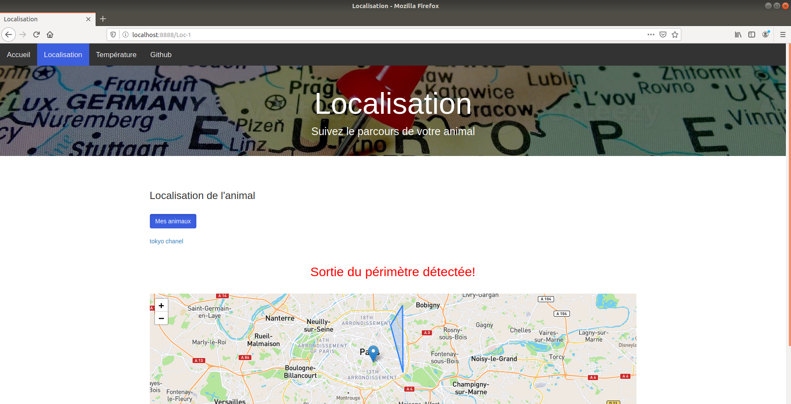

# Projet IOT : ePet

Projet réalisé dans le cadre de l'UE de "Projet IOT" , réalisé par 4 élèves ingénieurs de Polytech Sorbonne. Ce sujet a été proposé par Mme CHOTIN.

Le projet consiste en un collier connecté pour animal de compagnie, permettant de suivre sa position et d'avoir des informations pertinentes de son activité, notamment sa localisation, détecter s'il est sorti du périmètre de sécurité instauré par son maître. Le collier est équipé d'une ESP32 qui récupère également la température de l'animal afin de vérifier son état de santé.

## Comment obtient-on ces différentes informations :
 - Les données sont envoyées via Sigfox à notre serveur local hébergé sur une Raspberry Pi.  
 - Les déplacements sont détectés via un accéléromètre et les températures via un thermomètre.
 - La localisation est obtenue à partir des réseaux WIFI détectés à proximité de l'ESP32. On récupère les deux réseaux WIFI avec un signal le plus puissant et on envoie les informations à l'API Google qui nous renvoie la géolocalisation de l'animal.
 - Le maître peut visualiser ces données via le site mis en place hébergé par le serveur.

## Serveur :

Pour la partie serveur, toutes les informations se trouvent dans la partie CLOUD. Il y a également un tutoriel pour configurer une box et une raspberry pi afin d'héberger un site web.

####[Lien CLOUD](https://github.com/Polytech-Sorbonne/EI-SE5_2020-2021_ePet/tree/main/CLOUD)

## Electronique :

Pour la partie électronique, le matériel utilisé est renseigné dans le fichier ####Liste_du_matériels_finale . On obtient le système ci-dessous:

    

Dans cette partie, vous trouverez également :
####
 * les codes arduino pour ESP32 (voir BLE/ et CODE/)
 * les différentes adresses MAC à exclure pour la détection des adresses MAC des WIFI
 * les schémas des PCB ainsi que les fichiers des traçages et de perçage.
 * les schémas électroniques pour effectuer les branchements des capteurs sur une plaque LABDEC  

## Fonctionnement du site :

Pour visualiser les différentes données envoyées par l'antenne Sigfox, nous avons réalisé un site. Ce site est constitué de plusieurs pages HTML.

### Identification :

Lorsque qu'un utilisateur veut consulter son compte utilisateur, il doit obligatoirement renseigner son identifiant ainsi que son mot de passe pour se connecter.

### Espace utilisateur :

Cet espace permet à l'utilisateur de sélectionner l'information qui veut consulter. Il peut donc accéder soit à la localisation soit à la température de ces animaux de compagnie. Il peut également consulter le code source disponible sur ce Github.

### Localisation :

Dans cette page, on peut choisir l'animal pour lequel on veut consulter sa position. Lorsque l'animal est en dehors du périmètre défini, un message s'affiche.

### Température :  

Pour la température, on peut consulter la température de son animal grâce à un tableau. La température s'affiche seulement dans le cas où la température est anormale.

